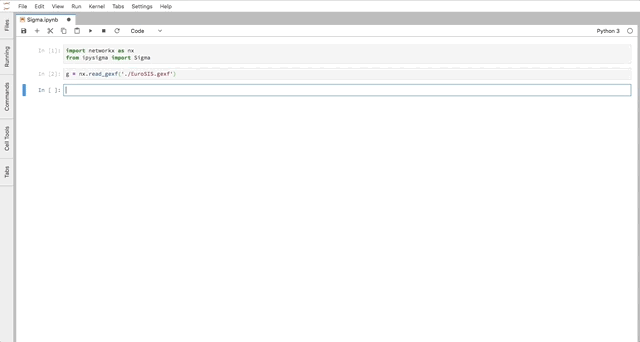

ipysigma
===============================

A custom Jupyter widget library to display graphs using sigma.js

Installation
------------

To install use pip:

    $ pip install ipysigma
    $ jupyter nbextension enable --py --sys-prefix ipysigma

If you have JupyterLab, you will also need to install the JupyterLab extension:

    $ jupyter labextension install @jupyter-widgets/jupyterlab-manager
    $ jupyter labextension install ipysigma

  

Usage
-----

You can check out some examples [here](./notebooks/Examples.ipynb).

For a development installation (requires npm),

    $ git clone https://github.com/ipysigma.git
    $ cd ipysigma
    $ pip install -e .
    $ jupyter nbextension install --py --symlink --sys-prefix ipysigma
    $ jupyter nbextension enable --py --sys-prefix ipysigma
