[](https://doi.org/10.5281/zenodo.7446060)

# ipysigma

A [Jupyter](https://jupyter.org/) widget using [sigma.js](https://www.sigmajs.org/) and [graphology](https://graphology.github.io/) to render interactive networks directly within the result of a notebook cell.

[Live Demo](https://medialab.github.io/ipysigma/demo.html)

`ipysigma` has been designed to work with either [`networkx`](https://networkx.org/) or [`igraph`](https://igraph.readthedocs.io).

`ipysigma` lets you customize a large number of the graph's visual variables such as: node color, size, label, border, halo, pictogram, shape and edge color, size, type, label etc.

For an exhaustive list of what visual variables you may tweak, check the "[Available visual variables](#available-visual-variables)" part of the documentation.

<p align="center">
  
</p>

`ipysigma` is also able to display synchronized & interactive "small multiples" of a same graph to easily compare some of its features.

<p align="center">
  
</p>

## Summary

- [Installation](#installation)
- [Quick start](#quick-start)
- [Examples](#examples)
  - [Compute a Louvain partition and use it as node color](#compute-a-louvain-partition-and-use-it-as-node-color)
  - [Use networkx/igraph/custom metrics as visual variables](#use-networkxigraphcustom-metrics-as-visual-variables)
  - [Display a pandas DataFrame as a graph](#display-a-pandas-dataframe-as-a-graph)
  - [Comparing two features of a graph](#comparing-two-features-of-a-graph)
  - [More examples: functional testing notebooks](#more-examples-functional-testing-notebooks)
- [What data can be used as visual variable](#what-data-can-be-used-as-visual-variable)
- [Visual variables and kwargs naming rationale](#visual-variables-and-kwargs-naming-rationale)
- [Scales, palettes and gradients](#scales-palettes-and-gradients)
- [Widget-side metrics](#widget-side-metrics)
- [Frequently asked questions](#frequently-asked-questions)
  - [Why are there so few labels displayed?](#why-are-there-so-few-labels-displayed)
  - [Why are some of my categories mapped to a dull grey?](#why-are-some-of-my-categories-mapped-to-a-dull-grey)
  - [I gave colors to node_color but arbitrary colors are displayed by the widget instead](#i-gave-colors-to-node_color-but-arbitrary-colors-are-displayed-by-the-widget-instead)
  - [My computer sounds like an airplane taking off](#my-computer-sounds-like-an-airplane-taking-off)
  - [Some of my widgets only display labels or a glitchy black box](#some-of-my-widgets-only-display-labels-or-a-glitchy-black-box)
  - [My graph is ugly, make it beautiful like Gephi](#my-graph-is-ugly-make-it-beautiful-like-gephi)
- [Available visual variables](#available-visual-variables)
  - [node_color](#node_color)
  - [node_color_saturation](#node_color_saturation)
  - [node_size](#node_size)
  - [node_label](#node_label)
  - [node_label_size](#node_label_size)
  - [node_label_color](#node_label_color)
  - [node_border_size](#node_border_size)
  - [node_border_ratio](#node_border_ratio)
  - [node_border_color](#node_border_color)
  - [node_pictogram](#node_pictogram)
  - [node_pictogram_color](#node_pictogram_color)
  - [node_shape](#node_shape)
  - [node_halo_size](#node_halo_size)
  - [node_halo_color](#node_halo_color)
  - [edge_color](#edge_color)
  - [edge_type](#edge_type)
  - [edge_size](#edge_size)
  - [edge_curveness](#edge_curveness)
  - [edge_label](#edge_label)
- [API Reference](#api-reference)
  - [Sigma](#sigma)
    - [#.get_layout](#get_layout)
    - [#.get_camera_state](#get_camera_state)
    - [#.get_selected_node](#get_selected_node)
    - [#.get_selected_edge](#get_selected_edge)
    - [#.get_selected_node_category_values](#get_selected_node_category_values)
    - [#.get_selected_edge_category_values](#get_selected_edge_category_values)
    - [#.render_snapshot](#render_snapshot)
    - [#.to_html](#to_html)
    - [Sigma.write_html](#sigmawrite_html)
    - [Sigma.set_defaults](#sigmaset_defaults)
  - [SigmaGrid](#sigmagrid)
    - [#.add](#add)
  - [How to cite](#how-to-cite)

## Installation

You can install using `pip`:

```bash
pip install ipysigma
```

You will also need to install either `networkx` or `igraph`.

If you are using an older version of Jupyter, you might also need to enable the nbextension likewise:

```bash
jupyter nbextension enable --py --sys-prefix ipysigma

# You might need one of those other commands
jupyter nbextension enable --py --user ipysigma
jupyter nbextension enable --py --system ipysigma
```

If you want to use `ipysigma` on [Google Colab](https://colab.research.google.com), you will need to enable widget output using the following code:

```python
from google.colab import output

output.enable_custom_widget_manager()
```

Remember you can always install packages in Colab by executing the following command in a cell:

```
!pip install networkx ipysigma
```

## Quick start

*Using networkx*

```python
import networkx as nx
from ipysigma import Sigma

# Importing a gexf graph
g = nx.read_gexf('./my-graph.gexf')

# Displaying the graph with a size mapped on degree and
# a color mapped on a categorical attribute of the nodes
Sigma(g, node_size=g.degree, node_color='category')
```

*Using igraph*

```python
import igraph as ig
from ipysigma import Sigma

# Generating a graph
g = ig.Graph.Famous('Zachary')

# Displaying the graph with a size mapped on degree and
# a color mapped on node betweenness centrality, using
# a continuous color scale named "Viridis"
Sigma(g, node_size=g.degree, node_color=g.betweenness(), node_color_gradient='Viridis')
```

## Examples

### Compute a Louvain partition and use it as node color

`ipysigma` is able to compute metrics on the widget side using [graphology](https://graphology.github.io/). As such, you can ask it to compute e.g. a Louvain partitioning if you don't want or cannot do it on the python side.

For more information about available metrics and how to specify them, check [this](#widget-side-metrics) part of the documentation.

```python
Sigma(g, node_metrics=["louvain"], node_color="louvain")

# Renaming the target attribute
Sigma(g, node_metrics={"community": "louvain"}, node_color="community")

# Passing custom parameters
Sigma(
  g,
  node_metrics={"community": {"name": "louvain", "resolution": 1.5}},
  node_color="community"
)
```

### Use networkx/igraph/custom metrics as visual variables

Use networkx metrics:
```python
import networkx as nx

g = nx.path_graph(5)
Sigma(g, node_size=nx.eigenvector_centrality(g))
```

Use igraph metrics:
```python
import igraph as ig

g = ig.Graph.GRG(5, 0.5)
Sigma(g, node_size=g.pagerank(), node_color=g.connected_components())
```

Use custom metrics:
```python
import networkx as nx

def even_or_odd(node):
  return node % 2 == 0

g = nx.path_graph(5)
Sigma(g, node_color=even_or_odd)
```
Read [this](#what-data-can-be-used-as-visual-variable) for an exhaustive list of what can be used as visual variables.

### Display a pandas DataFrame as a graph

Converting tabular data to a graph is not obvious. So for this, we advise to use helper functions found in our other library python [`pelote`](https://github.com/medialab/pelote#readme).

In this first example, we create a graph from a DataFrame of edges:

```python
import pandas as pd
from pelote import edges_table_to_graph

# Alice invited Bob and Chloe. Bob invited Chloe twice.
df = pd.DataFrame({
  "hosts": ["Alice", "Alice", "Bob", "Bob"],
  "guests": ["Bob", "Chloe", "Chloe", "Chloe"]
})

g = edges_table_to_graph(
  df,
  edge_source_col="hosts",
  edge_target_col="guests",
  count_rows_as_weight=True,
  directed=True
)

Sigma(g, edge_size='weight')
```

Using pelote again, you can also create a bipartite network (students and their professors, for example) with the `table_to_bipartite_graph` function:

```python
import pandas as pd
from pelote import table_to_bipartite_graph

df = pd.DataFrame({
  "professor": ["A", "A", "A", "B", "B", "B", "B"],
  "student": ["C", "D", "E", "C", "F", "G", "H"],
})

g = table_to_bipartite_graph(df, 'student', 'professor', node_part_attr='status')

Sigma(g, node_color='status', default_node_size=10, show_all_labels=True)
```

### Comparing two features of a graph

Let's say we have a graph of websites that we categorized by type and language and we want to compare the distribution of those categories on the graph's topology. We could use node color for language and border color for type but you will quickly see that this is probably not readable.

To solve this kind of problems and enable its users to easily compare multiple features of a graph, `ipysigma` exposes a `SigmaGrid` widget that arranges multiple synchronized views of the same graph on a grid:

```python
from ipysigma import SigmaGrid

# Views to display can be specified through the `views` kwarg, expecting
# a list of dicts of keyword arguments to give to the underlying Sigma widgets:
SigmaGrid(g, views=[
  {"node_color": "type"},
  {"node_color": "type"}
])

# You can do the same by using the `#.add` method of the grid to
# dynamically add views:
SigmaGrid(g).add(node_color="lang").add(node_color="type")

# Any kwarg passed to the grid directly will be used by all of the views.
# This is useful to avoid repetition:
SigmaGrid(g, node_size=g.degree, views=[
  {"node_color": "type"},
  {"node_color": "type"}
])

# You can of course display more than 2 views
# By default the grid has 2 columns and will wrap to new rows,
# but you can change the number of columns using the `columns` kwarg:
SigmaGrid(g, columns=3, views=[
  {"node_size": g.degree},
  {"node_size": g.in_degree},
  {"node_size": g.out_degree}
])
```

### More examples: functional testing notebooks

If you want comprehensive examples of the widget's visual variables being used,
you can read the notebooks found [here](./notebooks/Tests/), which serve as functional tests to the library.

## What data can be used as visual variable

There are several ways to specify what you want to use as visual variables
(read [this](#visual-variables-and-kwarg-naming-rationale) for a detailed explanation).

Here is the exhaustive list of what is possible:

*Name of a node or edge attribute*

```python
# Let's say your nodes have a "lang" attribute, we can use its modalities as values for
# a categorical color palette:
Sigma(g, node_color='lang')
```

*Node or edge mapping*

```python
# You can store the data in a mapping, e.g. a dictionary, likewise:
node_lang = {'node1': 'en', 'node2': 'fr', ...}
Sigma(g, node_color=node_lang)

# For edges, the mapping's key must be a 2-tuple containing source & target nodes.
# Note that for undirected graphs, the order of nodes in the tuple
# does not make any difference as both will work.
edge_type = {('node1', 'node2'): 'LIKES', ('node2', 'node3'): 'LOVES'}
```

*Arbitrary iterable*

```python
# Any arbitrary iterable such as generators, ranges, numpy vectors,
# pandas series etc. will work. The only requirement is that they should
# follow the order of iteration of nodes or edges in the graph, so we may
# align the data properly.

# Creating a 0 to n generic label for my nodes
Sigma(g, node_label=range(len(g)))

# Random size for my edges
Sigma(g, edge_size=(random() for _ in g.edges))

# Numpy vector
Sigma(g, node_size=np.random.rand(len(g)))

# Pandas series
Sigma(g, edge_size=df.edge_weights)
```

*Partition*

```python
# A partition, complete or not, but not overlapping, of nodes or edges:
# Must be a list of lists or a list of sets.
communities = [{2, 3, 6}, {0, 1}, {4, 6}]

Sigma(g, node_color=communities)
```

*networkx/igraph degree view*

```python
# Mapping node size on degree is as simple as:
Sigma(g, node_size=g.degree)
```

*igraph VertexClustering*

```python
# IGraph community detection / clustering methods return a VertexClustering object
Sigma(g, node_color=g.connected_components())

Sigma(g, node_color=g.community_multilevel())
```

*Arbitrary callable*

```python
# Creating a label for my nodes
Sigma(g, node_label=lambda node: 'Label of ' + str(node))

# Using edge weight as size only for some source nodes
Sigma(g, edge_size=lambda u, v, a: attr['weight'] if g.nodes[u]['part'] == 'main' else 1)

# Node callables will be given the following arguments:
#   1. node key
#   2. node attributes

# Edge callables will be given the following arguments:
#  1. source node key
#  2. target node key
#  3. edge attributes

# Note that given callables may choose to take any number of those arguments.
# For instance, the first example only uses the first argument but still works.
```

*Set*

```python
# A set will be understood as a binary partition with nodes or edges being
# in it or outside it. This will be mapped to a boolean value, with `True`
# meaning the node or edge was in the partition.

# This will display the nodes 1, 5 and 6 in a color, and all the other ones
# in a different color.
Sigma(g, node_color={1, 5, 6})
```

## Visual variables and kwargs naming rationale

`ipysigma` lets its users tweak a large number of [visual variables](#available-visual-variables). They all work through a similar variety of keyword arguments given to the [`Sigma`](#sigma) widget.

In `ipysigma` visual variables can be given:

* categorical data, which means they will map category values to discrete visualization values such as a node's category being associated with a given color.
* continuous data, which means they will map numerical values to a range of sizes or a gradient of colors, like when representing a node's degree by a size on screen.

*kwargs naming rationale*

To be able to be drawn on screen, every visual variable must use values that have a meaning for the the widget's visual representation. For colors, it might be a HTML color name such as `#fa65ea` or `cyan`. For sizes, it might be a number of pixels etc.

If you know what you are doing and want to give `ipysigma` the same "raw" values as those expected by the visual representation directly, all variables have kwargs starting by `raw_`, such as `raw_node_color`.

But if you want `ipysigma` to map your arbitrary values to a suitable visual representation, all variables have a kwarg without any prefix, for instance `node_color`.

In which case, if you use categorical data, `ipysigma` can generate or use palettes to map the category values to e.g. colors on screen. You can always customize the palette or mapping using a kwarg suffixed with `_palette` or `_mapping` such as `node_color_palette` or `node_shape_mapping`.

And if you use numerical data, then values will be mapped to an output range, usually in pixels, that can be configured with a kwarg suffixed with `_range` such as `node_size_range`. Similarly, if you want to map numerical data to a gradient of colors, you will find kwarg suffixed with `_gradient` such as `node_color_gradient`.

Sometimes, some values might fall out of the represented domain, such as non-numerical values for continuous variables, or categories outside of the colors available in the given palette. In which case there always exists a kwarg prefixed with `default_`, such as `default_node_color`. A neat trick is also to use those kwargs as a way to indicate a constant value if you want all your edges to have the same color for instance, or your nodes to have the same size in pixels.

Finally, it's usually possible to tweak the way numerical values will be mapped from their original domain to the visual one. This is what you do, for instance, when you choose to use a logarithmic scale on a chart to better visualize a specific distribution. Similarly, relevant `ipysigma` visual variables give access to a kwarg suffixed `_scale`, such as `node_color_scale` that lets you easily switch from a linear to a logarithmic or power scale etc. (for more information about this, check [this](#scales-palettes-and-gradients) in the next part of the documentation).

To summarize, let's finish with two exhaustive examples: node color & node size.

*Categorical or continuous variable: node color as an example*

* **node_color**: this kwarg expects some arbitrary values related to your nodes. Those values can be given in multiple ways listed [here](#what-data-can-be-used-as-visual-variable). By default, `node_color` is a categorical variable. Hence, given values will be mapped to suitable colors, from a palette generated automatically for you. If you want your data to be interpreted as continuous instead, you will need to give a gradient to the variable through `node_color_gradient`.
* **raw_node_color**: this kwarg does not expect arbitrary values but CSS colors instead. This way you can always regain full control on the colors you want for your nodes if none of `ipysigma` utilities suit your particular use-case.
* **default_node_color**: the `default_` kwargs always expect a value that will be used in the final representation, so here a CSS color, that will be used if a node category is not found in the color palette or if a node value is not numerical and we are using a gradient.
* **node_color_palette**: by default, `ipysigma` uses [`iwanthue`](https://medialab.github.io/iwanthue/) to automatically generate fitting color palettes for the categories present in the given data. But sometimes you might want to customize the colors used. In which case this kwarg expects either a dictionary mapping category values to a CSS color such as `{'en': 'blue, 'fr': 'red'}` or the name of a categorical color scheme from [d3-scale-chromatic](https://github.com/d3/d3-scale-chromatic#readme) such as `Tableau10` or `RdYlBu` for instance.
* **node_color_gradient**: if you want to use a color gradient for your node to represent continuous data, you will need to give this kwarg either a 2-tuple containing the "lowest" and "highest" color such as `("yellow", "red")` or the name of a continuous color gradient from [d3-scale-chromatic](https://github.com/d3/d3-scale-chromatic#readme) such as `Inferno` or `YlGn` for instance.
* **node_color_scale**: finally, if you gave a gradient to `node_color_gradient` and want to apply a nonlinear scale to the given data, you can pass the name of the scale to use such as `log` or a 2-tuple containing the name of the scale and an optional param such as the scale's base in the case of a logarithmic scale. Here is a binary log scale for instance: `("log", 2)`.

*Continuous variable: node size as an example*

* **node_size**: this kwarg expects some arbitrary numerical values related to your nodes. Those values can be given in multiple ways listed [here](#what-data-can-be-used-as-visual-variable). Then they will be mapped using a scale given to `node_size_scale` to a range in pixels given to `node_size_range` before being used on screen.
* **raw_node_size**: if you want to bypass the scale and the range altogether, this kwarg directly takes values to be considered as pixels on screen.
* **default_node_size**: if no relevant value can be found for a node, or if said value is not a valid number, the widget will use this size, expressed in pixels, instead.
* **node_size_scale**: if you want to apply a nonlinear scale to the given data, you can pass the name of the scale to use such as `log` or a 2-tuple containing the name of the scale and an optional param such as the scale's base in the case of a logarithmic scale. Here is a binary log scale for instance: `("log", 2)`.
* **node_size_range**: this kwarg lets you customize the output range in pixels we should map the node numerical values to. For instance, if we want to have our nodes to have sizes between `1` pixel and `25` pixels, we would give it `(1, 25)`. Note that most visual variables have a default range and this kwarg can usually be omitted if the defaults suit you.

For a comprehensive view of the available visual variables, the values they expect and how they can be customized, read [this](#available-visual-variables) next part of the documentation.

## Scales, palettes and gradients

*Available scales*

* **lin**: linear scale, used by default when scale is not specified.
* **log**: logarithmic scale. Takes an optional base (`e` by default).
* **log+1**: logarithmic scale incrementing your values by one. This is a well-known visualization trick designed to avoid issues with zeros, which is often the case when using some typical node metrics. Takes an optional base (`e` by default)..
* **pow**: power scale. Takes an optional exponent (`2` by default).
* **sqrt**: square root scale (same as power scale but with inverted exponent). Takes an optional exponent (`2` by default).

All the `_scale` kwargs can take the following:

* Nothing (the default), then the scale remains linear: `node_size_scale=None`.
* The name of the scale directly: `node_size_scale="log"`.
* A 2-tuple containing the name of the scale and its parameter: `node_size_scale=("log", 2)`.

*Color palettes*

By default, color palettes are generated for you by `ipysigma` using [iwanthue](https://medialab.github.io/iwanthue/). `ipysigma` will first count the number of distinct categories to represent, sort them by frequency and generate a palette of up to `10` colors for the most used ones. The other one will use the default one given to the relevant `default_` kwarg such as `default_node_color` for instance.

Note that this maximum number of `10` can be increased using the `max_categorical_colors` kwarg.

Note also that the palette generation is seeded using the mapped attribute name in the data so that the palette is always the same (if the name and the category count remains the same), but is different from one attribute to the other.

If you don't want `ipysigma` to generate color palettes for you, you can give your own palette through the relevant `_palette` kwarg such as `node_color_palette`, or use some [d3-scale-chromatic](https://github.com/d3/d3-scale-chromatic#readme) one (they have names starting with `scheme`).

Here is the full list of those palettes supported by `ipysigma`: `Accent`, `Blues`, `BrBG`, `BuGn`, `BuPu`, `Category10`, `Dark2`, `GnBu`, `Greens`, `Greys`, `OrRd`, `Oranges`, `PRGn`, `Paired`, `Pastel1`, `Pastel2`, `PiYG`, `PuBu`, `PuBuGn`, `PuOr`, `PuRd`, `Purples`, `RdBu`, `RdGy`, `RdPu`, `RdYlBu`, `RdYlGn`, `Reds`, `Set1`, `Set2`, `Set3`, `Spectral`, `Tableau10`, `YlGn`, `YlGnBu`, `YlOrBr`, `YlOrRd`.

*Color gradients*

Color gradients can be defined as a range from "lowest" to "highest" color, e.g. `("yellow", "red)`.

They can also be taken from any [d3-scale-chromatic](https://github.com/d3/d3-scale-chromatic#readme) continuous gradient (they have names starting with `interpolate`).

Here is the full list of those gradients supported by `ipysigma`: `Blues`, `BrBG`, `BuGn`, `BuPu`, `Cividis`, `Cool`, `CubehelixDefault`, `GnBu`, `Greens`, `Greys`, `Inferno`, `Magma`, `OrRd`, `Oranges`, `PRGn`, `PiYG`, `Plasma`, `PuBu`, `PuBuGn`, `PuOr`, `PuRd`, `Purples`, `Rainbow`, `RdBu`, `RdGy`, `RdPu`, `RdYlBu`, `RdYlGn`, `Reds`, `Sinebow`, `Spectral`, `Turbo`, `Viridis`, `Warm`, `YlGn`, `YlGnBu`, `YlOrBr`, `YlOrRd`.

## Widget-side metrics

Since `ipysigma` is using [graphology](https://graphology.github.io/), it can also draw from its library of graph theory metrics.

As such, the `node_metrics` enables you to ask your widget to compute node metrics on its own and use to map the result on any visual variable.

Here is how you can specify metrics to be computed:

```python
# node_metrics expects an iterable of metrics to compute:
Sigma(g, node_metrics=["louvain"], node_color="louvain")

# They can be specified by name, but you can also specify through
# a dictionary if you need parameters for the metrics:
Sigma(g, node_metrics=[{"name": "louvain", "resolution": 1.5}], node_color="louvain")

# You can also give a dictionary mapping resulting attribute name to
# the metric to compute if you don't want to map the result on an attribute
# having the same name as the metric:
Sigma(g, node_metrics={"community": "louvain"}, node_color="community")
Sigma(g, node_metrics={"community": {"name": "louvain", "resolution": 1.5}}, node_color="community")
```

*Available node metrics & their parameters*

* **louvain**: Louvain algorithm for community detection (through modularity optimization)
  * **resolution** *?float* [`1`]: resolution parameter.

## Frequently asked questions

### Why are there so few labels displayed?

Labels are costly to render and can negate the benefit of using a WebGL renderer such as sigma.js to render interactive graphs. As such, sigma.js relies on a constant size grid to select the "worthiest" labels to display, after taking camera zoom into account.

You can tweak the parameters of this grid using `label_grid_cell_size` and `label_density`. Decreasing the first one or increasing the second one will result in more labels being displayed.

Also, by default, the label of a node is displayed only if its size in pixels is larger than a threshold. You can change that threshold using the `label_rendered_size_threshold` kwarg.

Finally, if you don't want to deal with all this nonsense and just want to display all labels because you know what you are doing and don't care about performance, you can just use `show_all_labels=True` instead.

### Why are some of my categories mapped to a dull grey?

When `ipysigma` generates palettes for you, it only uses up to `10` colors by default. This number can be increased using the `max_categorical_colors` kwarg. For more information about palette generation, read [this](#scales-palettes-and-gradients) part of the documentation.

Some designer told me (while holding a baseball bat) that it is unwise to have more than 10 categorical colors because you won't be able to distinguish them anymore. My hands are tied. Don't ask me to change this.

### I gave colors to node_color but arbitrary colors are displayed by the widget instead

`node_color` does not expect colors per se but arbitrary data that will be mapped to a suitable color palette for you. If you want to give colors directly, use `raw_node_color` instead. For more information about the visual variables kwarg naming rationale, read [this](#visual-variables-and-kwargs-naming-rationale) part of the documentation.

### My computer sounds like an airplane taking off

Don't forget to turn off the layout when it has converged (the pause button on the left). There is no convincing way to automatically detect when layout has converged so we must rely on you, the user, to indicate when it's done.

If you want to start the layout automatically when instantiating the widget and make sure it will automatically stop after, say, 10 seconds, use `start_layout=10`.

### Some of my widgets only display labels or a glitchy black box

Your GPU can only render so many webgl canvases in your browser tabs. So if you created too many widgets (this depends on the specifics of your computer and graphics card), it may gracefully deal with the situation by erasing the graph (but not the labels since those are rendered using 2d canvases) or by glitching to death.

### My graph is ugly, make it beautiful like Gephi

Use `default_edge_type="curve"`, `node_border_color_from="node"`, `label_size=g.degree` and `label_font="cursive"` and you should have a dazzling Gephi graph.

<p align="center">
  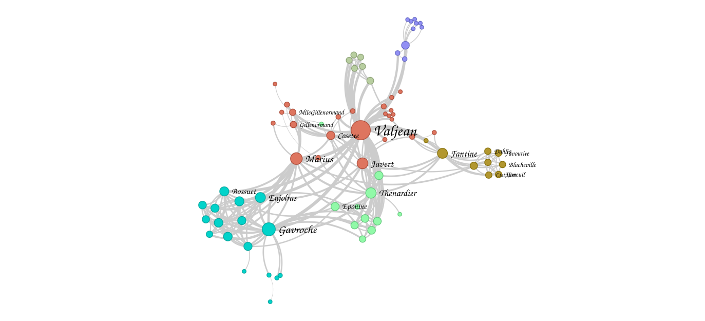
</p>

## Available visual variables

### node_color


**Type**

Categorical or continuous.

**Raw values**

HTML [named color](https://www.w3schools.com/tags/ref_colornames.asp) or hex color or rgb/rgba color. Examples: `red`, `#fff`, `#a89971`, `rgb(25, 25, 25)`, `rgba(25, 145, 56, 0.5)`

**Related kwargs**

* **node_color**
* **raw_node_color**
* **default_node_color**
* **node_color_palette**
* **node_color_gradient**
* **node_color_scale**

### node_color_saturation

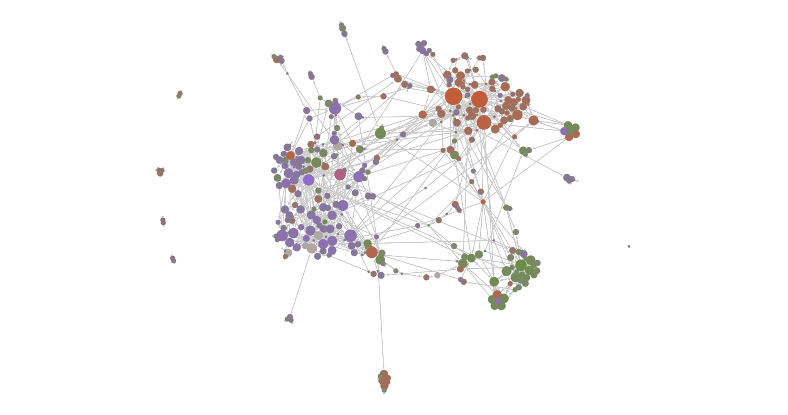

**Type**

Continuous.

**Raw values**

A percentage of color saturation. Examples: `0.1`, `0.96`.

**Related kwargs**

* **node_color_saturation**
* **raw_node_color_saturation**
* **default_node_color_saturation**
* **node_color_saturation_range**
* **node_color_saturation_scale**

### node_size

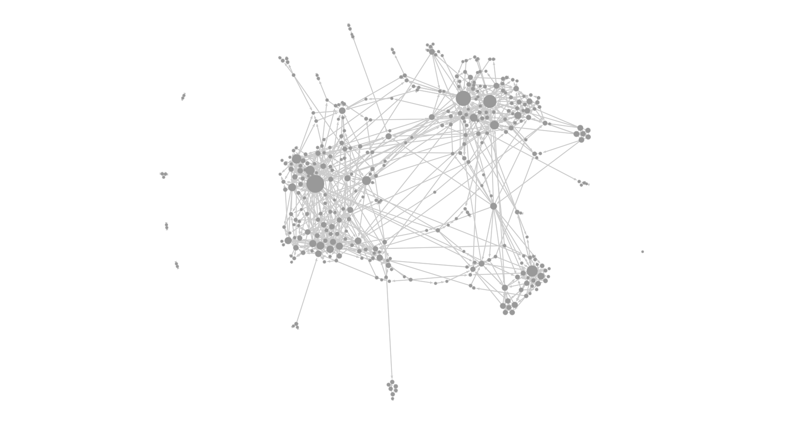

**Type**

Continuous.

**Raw values**

A node size, i.e. a circle radius, in pixels, with default camera (not zoomed nor unzoomed).

**Related kwargs**

* **node_size**
* **raw_node_size**
* **default_node_size**
* **node_size_range**
* **node_size_scale**

### node_label

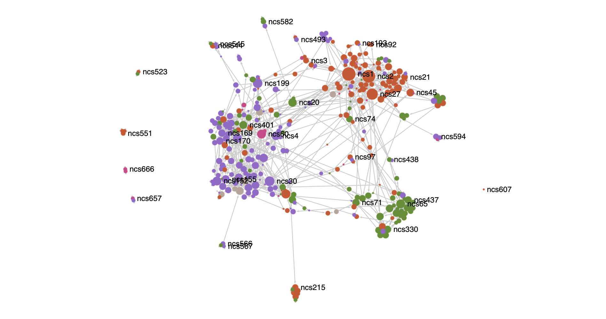

**Type**

Raw only.

**Raw values**

A text label.

**Related kwargs**

* **node_label**
* **raw_node_label**
* **default_node_label**

### node_label_size

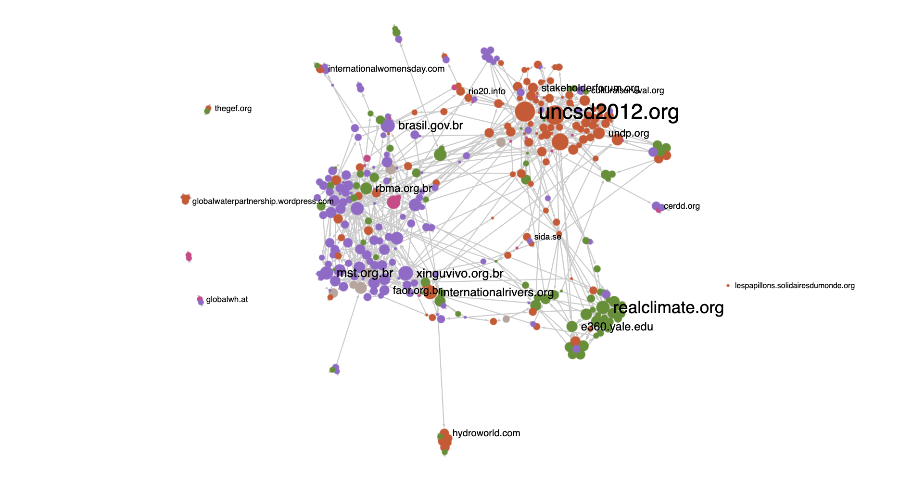

**Type**

Continuous.

**Raw values**

A font size for the label text, in pixels.

**Related kwargs**

* **node_label_size**
* **raw_node_label_size**
* **default_node_label_size**
* **node_label_size_range**

### node_label_color

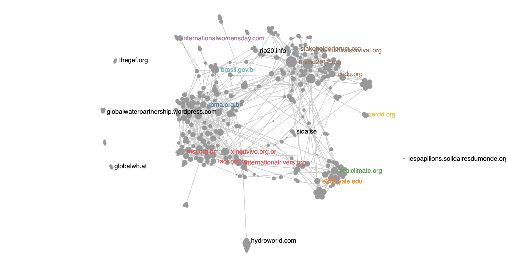

**Type**

Categorical.

**Raw values**

HTML [named color](https://www.w3schools.com/tags/ref_colornames.asp) or hex color or rgb/rgba color. Examples: `red`, `#fff`, `#a89971`, `rgb(25, 25, 25)`, `rgba(25, 145, 56, 0.5)`

**Related kwargs**

* **node_label_color**
* **raw_node_label_color**
* **default_node_label_color**
* **node_label_color_palette**

### node_border_size


**Type**

Continuous.

**Raw values**

A border size, in pixels, with default camera (not zoomed nor unzoomed).

Note that this border size will be added to the node's radius.

**Related kwargs**

* **node_border_size**
* **raw_node_border_size**
* **default_node_border_size**
* **node_border_size_range**

**Notes**

Borders are only shown on screen if a [node_border_size](#node_border_size) OR a [node_border_ratio](#node_border_ratio) AND a [node_border_color](#node_border_color) are defined.

### node_border_ratio


**Type**

Continuous.

**Raw values**

A border ratio, in percentage, with default camera (not zoomed nor unzoomed).

Note that this border ratio will eat the node's size.

**Related kwargs**

* **node_border_ratio**
* **raw_node_border_ratio**
* **default_node_border_ratio**
* **node_border_ratio_range**

**Notes**

Borders are only shown on screen if a [node_border_size](#node_border_size) OR a [node_border_ratio](#node_border_ratio) AND a [node_border_color](#node_border_color) are defined.

### node_border_color

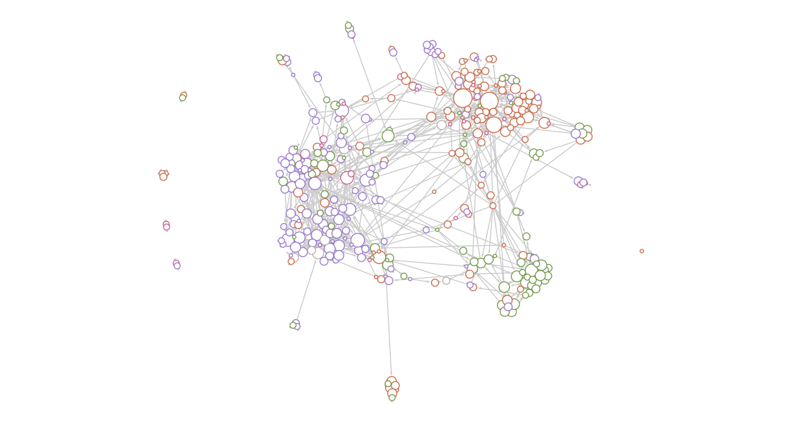

**Type**

Categorical or continuous.

**Raw values**

HTML [named color](https://www.w3schools.com/tags/ref_colornames.asp) or hex color or rgb/rgba color. Examples: `red`, `#fff`, `#a89971`, `rgb(25, 25, 25)`, `rgba(25, 145, 56, 0.5)`

**Related kwargs**

* **node_border_color**
* **raw_node_border_color**
* **default_node_border_color**
* **node_border_color_palette**
* **node_border_color_gradient**
* **node_border_color_scale**

**Notes**

Borders are only shown on screen if a [node_border_size](#node_border_size) OR a [node_border_ratio](#node_border_ratio) AND a [node_border_color](#node_border_color) are defined.

### node_pictogram


**Type**

Categorical.

**Raw values**

The name of any Google Material Icon as listed [here](https://fonts.google.com/icons) (the name must be lowercase and snake_case, e.g. the name "Arrow Drop Done" should be given to `ipysigma` as `arrow_drop_done`).

Alternatively, one can also give urls of publicly accessible svg icons such as https://fonts.gstatic.com/s/i/short-term/release/materialsymbolsoutlined/arrow_drop_down/default/48px.svg

**Related kwargs**

* **raw_node_pictogram**
* **default_node_pictogram**

**Notes**

Pictograms are only shown on screen if [node_pictogram](#node_pictogram) AND [node_pictogram_color](#node_pictogram_color) are defined.

### node_pictogram_color

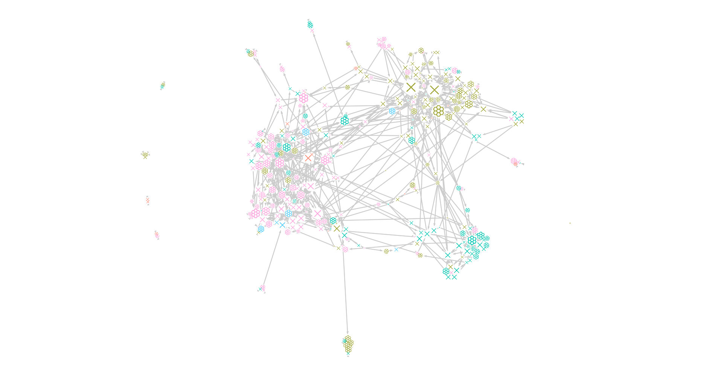

**Type**

Categorical.

**Raw values**

HTML [named color](https://www.w3schools.com/tags/ref_colornames.asp) or hex color or rgb/rgba color. Examples: `red`, `#fff`, `#a89971`, `rgb(25, 25, 25)`, `rgba(25, 145, 56, 0.5)`

**Related kwargs**

* **node_pictogram_color**
* **raw_node_pictogram_color**
* **default_node_pictogram_color**
* **node_pictogram_color_palette**

**Notes**

Pictograms are only shown on screen if [node_pictogram](#node_pictogram) AND [node_pictogram_color](#node_pictogram_color) are defined.

### node_shape

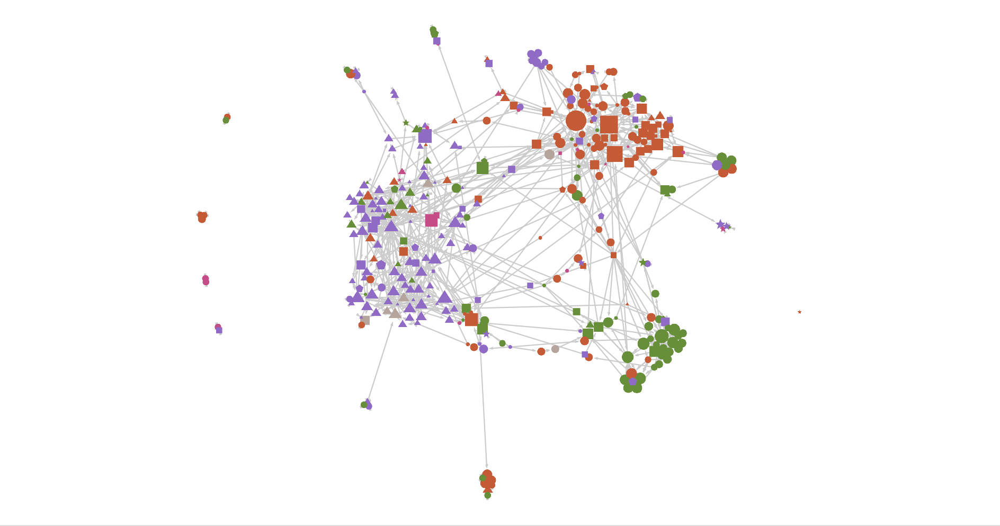

**Type**

Categorical.

**Raw values**

The name of a supported shape such as: `circle`, `triangle`, `square`, `pentagon`, `star`, `hexagon`, `heart` or `cloud`.

Alternatively, if you are feeling adventurous, it can also be the name of any Google Material Icon as listed [here](https://fonts.google.com/icons) (the name must be lowercase and snake_case, e.g. the name "Arrow Drop Done" should be given to `ipysigma` as `arrow_drop_done`).

Finally, one can also give urls of publicly accessible svg icons such as https://fonts.gstatic.com/s/i/short-term/release/materialsymbolsoutlined/arrow_drop_down/default/48px.svg

**Related kwargs**

* **node_shape**
* **raw_node_shape**
* **default_node_shape**
* **node_shape_mapping**

*Note*

Node shapes cannot be used with borders nor pictograms nor halos, as of yet.

### node_halo_size

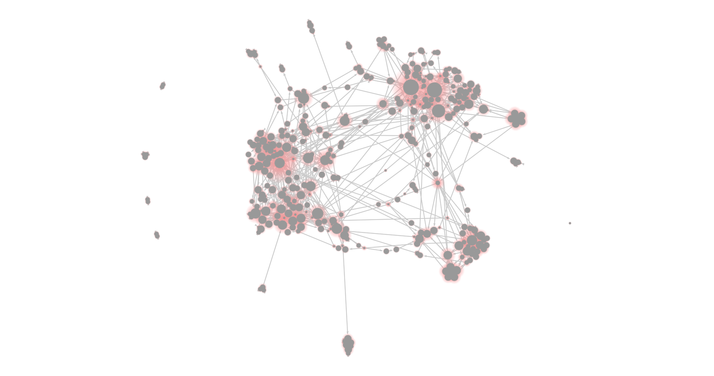

**Type**

Continuous.

**Raw values**

A halo size offset in pixels, with default camera (not zoomed nor unzoomed). The full halo radius will therefore be its size + its node's radius.

**Related kwargs**

* **node_halo_size**
* **raw_node_halo_size**
* **default_node_halo_size**
* **node_halo_size_range**
* **node_halo_size_scale**

### node_halo_color

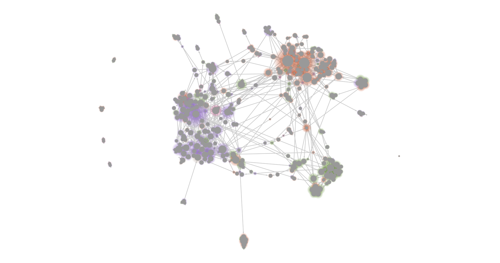

**Type**

Categorical or continuous.

**Raw values**

HTML [named color](https://www.w3schools.com/tags/ref_colornames.asp) or hex color or rgb/rgba color. Examples: `red`, `#fff`, `#a89971`, `rgb(25, 25, 25)`, `rgba(25, 145, 56, 0.5)`

**Related kwargs**

* **node_halo_color**
* **raw_node_halo_color**
* **default_node_halo_color**
* **node_halo_color_palette**
* **node_halo_color_gradient**
* **node_halo_color_scale**

### edge_color

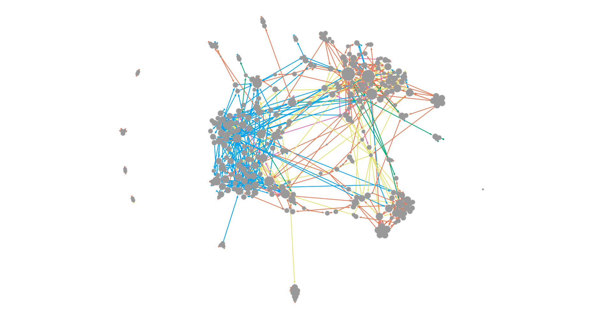

**Type**

Categorical or continuous.

**Raw values**

HTML [named color](https://www.w3schools.com/tags/ref_colornames.asp) or hex color or rgb/rgba color. Examples: `red`, `#fff`, `#a89971`, `rgb(25, 25, 25)`, `rgba(25, 145, 56, 0.5)`

**Related kwargs**

* **edge_color**
* **raw_edge_color**
* **default_edge_color**
* **edge_color_palette**
* **edge_color_gradient**
* **edge_color_scale**

### edge_type


### edge_size


**Type**

Continuous.

**Raw values**

An edge thickness in pixels, with default camera (not zoomed nor unzoomed).

**Related kwargs**

* **edge_size**
* **raw_edge_size**
* **default_edge_size**
* **edge_size_range**
* **edge_size_scale**

### edge_curveness

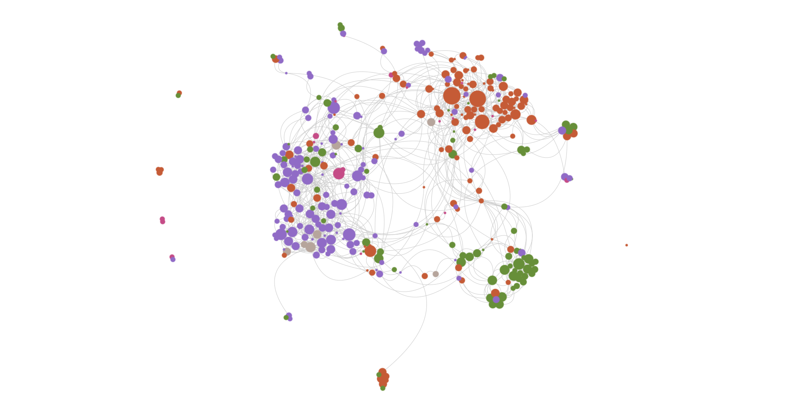

**Type**

Continuous.

**Raw values**

A percentage. Note that it can go beyond `1` and that `0` will make the edge disappear.

**Related kwargs**

* **default_edge_curveness**

### edge_label

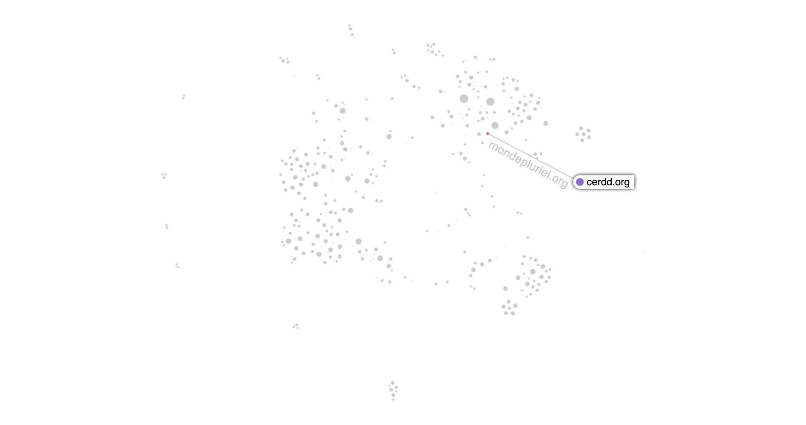

**Type**

Raw only.

**Raw values**

A text label.

**Related kwargs**

* **edge_label**
* **raw_edge_label**
* **default_edge_label**

## API Reference

### Sigma

*Arguments*

* **graph** *nx.AnyGraph or ig.AnyGraph* - networkx or igraph graph instance to explore.
* **name** *str, optional* `None` - name of the graph.
* **height** *int, optional* `500` - height of the widget container in pixels.
* **background_color** *str, optional* `"white"` - css color to use as the graph's background.
* **raw_height** *str, optional* `None` - raw css height. Can be useful in some html embedding scenarios. Only use this if you know what you are doing.
* **start_layout** *bool or float, optional* `False` - whether to automatically start the layout algorithm when mounting the widget. If a number is given instead, the layout algorithm will start and automatically stop after this many seconds.
* **node_metrics** *Iterable or Mapping, optional* `None` - node metrics to be computed by graphology by the widget's JavaScript code. Currently only supports "louvain" for community detection.
* **layout_settings** *dict, optional* `None` - settings for the ForceAtlas2 layout (listed here: https://graphology.github.io/standard-library/layout-forceatlas2#settings.
* **clickable_edges** *bool, optional* `False` - whether to allow user to click on edges to display their information. This can have a performance cost on larger graphs.
* **process_gexf_viz** *bool, optional* `True` - whether to process gexf files viz data for node & edges.
* **max_categorical_colors** *int, optional* `10` - max number of colors to be generated for a categorical palette. Categories, ordered by frequency, over this maximum will use the default color.
* **hide_info_panel** *bool, optional* `False` - whether to hide the information panel to the right of the widget.
* **hide_search** *bool, optional* `False` - whether to hide the search bar to the right of the widget.
* **hide_edges_on_move** *bool, optional* `False` - whether to hide the edges when the graph is being moved. This can be useful to improve performance when the graph is too large.
* **sync_key** *str, optional* - Key used by the widget to synchronize events between multiple instances of views of a same graph. Prefer using `SigmaGrid` when able, it will handle this advanced aspect of the widget for you.
* **sync_targets** *Iterable, optional* `("layout", "camera", "selection", "hover")` - Names of targets to synchronize through the `sync_key` kwarg. Targets include "layout", "camera", "selection" and "hover".
* **camera_state** *dict, optional* `{"x": 0.5, "y": 0.5, "ratio": 1, "angle": 0}` - Initial state for the widget's camera (which can be retrieved using the `#.get_camera_state` method).
* **selected_node** *str or int, optional* `None` - Key of the initially selected node in the widget (can be retrieved using the `#.get_selected_node` method).
* **selected_edge** *tuple, optional* `None` - (source, target) tuple of the initially selected edge in the widget (can be retrieved using the `#.get_selected_edge` method).
* **selected_node_category_values** *Iterable, optional* `None` - list of selected node category values (can be retrieved using the `#.get_selected_node_category_values` method).
* **selected_edge_category_values** *Iterable, optional* `None` - list of selected edge category values (can be retrieved using the `#.get_selected_edge_category_values` method).
* **label_font** *str, optional* `"sans-serif"` - font to be used with labels.
* **label_density** *int, optional* `1` - number of labels to display per grid cell for default camera zoom.
* **label_grid_cell_size** *int, optional* `250` - size in pixels of a square cell in the label selection grid.
* **label_rendered_size_threshold** *int, optional* `None` - minimum actual rendered size (after camera zoom operations) a node must have on screen for its label to be allowed to be displayed. If None, the threshold will be inferred based on the maximum node size of your graph.
* **show_all_labels** *bool, optional* `False` - macro setting making sure most, if not all, labels get displayed on screen. Might have an impact on performance with larger graphs.
* **layout** *Mapping, optional* `None` - node positions, expressed as a `{node: {x, y}` mapping.
* **node_color** *VariableData, optional* `None` - data to be used as categorical or continuous node color.
* **raw_node_color** *VariableData, optional* `"color"` - raw data (css colors) to be used for node colors.
* **node_color_gradient** *Iterable or str, optional* `None` - gradient of colors to map to, for instance: (`("yellow", "red")`), or name of a d3 continuous color scale (found here: https://github.com/d3/d3-scale-chromatic#readme), for instance: "Viridis". If given, node color will be interpreted as continuous rather than categorical.
* **node_color_scale** *tuple or str, optional* `None` - scale to use for node color. Can be a tuple containing the name of the scale and an additional param such as an exponent, or just the name of the scale to use: e.g. `("log", 2)` or `"pow"`. Available scales include: `"lin"`, `"log"`, `"log+1"`, `"pow"` & `"sqrt"`. If None is given, scale will default to `"lin"` for linear.
* **node_color_palette** *Mapping or str, optional* `None` - either a mapping from category values to css colors or the name of a d3 categorical color scale (found here: https://github.com/d3/d3-scale-chromatic#readme).
* **default_node_color** *str, optional* `"#999"` - default color for nodes.
* **node_color_saturation** *VariableData, optional* `None` - data to be used as continuous node color saturation.
* **raw_node_color_saturation** *VariableData, optional* `None` - raw data (percentage) to be used for node color saturation.
* **node_color_saturation_scale** *tuple or str, optional* `None` - scale to use for node color saturation. Can be a tuple containing the name of the scale and an additional param such as an exponent, or just the name of the scale to use: e.g. `("log", 2)` or `"pow"`. Available scales include: `"lin"`, `"log"`, `"log+1"`, `"pow"` & `"sqrt"`. If None is given, scale will default to `"lin"` for linear.
* **node_color_saturation_range** *Iterable, optional* `(0, 1)` - range of percentages to map to, for instance: `(0, 0.7)`.
* **default_node_color_saturation** *str, optional* `None` - default color saturation for nodes.
* **node_border_color** *VariableData, optional* `None` - data to be used as categorical or continuous node border color.
* **raw_node_border_color** *VariableData, optional* `"color"` - raw data (css colors) to be used for node border colors.
* **node_border_color_gradient** *Iterable or str, optional* `None` - gradient of colors to map to, for instance: (`("yellow", "red")`), or name of a d3 continuous color scale (found here: https://github.com/d3/d3-scale-chromatic#readme), for instance: "Viridis". If given, node border color will be interpreted as continuous rather than categorical.
* **node_border_color_palette** *Mapping or str, optional* `None` - either a mapping from category values to css colors or the name of a d3 categorical color scale (found here: https://github.com/d3/d3-scale-chromatic#readme).
* **node_border_color_from** *str, optional* `None` - optionally select node border color from the following options: "node".
* **default_node_border_color** *str, optional* - default color for node borders.
* **node_border_size** *VariableData, optional* `None` - data to be used as continuous node border size.
* **raw_node_border_size** *VariableData, optional* `None` - raw data (size in pixels) to be used for node border sizes.
* **node_border_size_range** *Iterable, optional* `(1, 5)` - range of sizes in pixels to map to, for instance: `(1, 15)`.
* **default_node_border_size** *int or float, optional* `1` - default size for node borders.
* **node_border_ratio** *VariableData, optional* `None` - data to be used as continuous node border ratio.
* **raw_node_border_ratio** *VariableData, optional* `None` - raw data (ratio in pixels) to be used for node border ratios.
* **node_border_ratio_range** *Iterable, optional* `(0.1, 0.5)` - range of ratios in pixels to map to, for instance: `(1, 15)`.
* **default_node_border_ratio** *int or float, optional* `0.1` - default ratio for node borders.
* **raw_node_pictogram** *VariableData, optional* `None` - raw data (pictogram name, as found here: https://fonts.google.com/icons or publicly accessible svg icon url) to be used for node pictograms.
* **default_node_pictogram** *str, optional* `None` - default pictogram for nodes.
* **node_pictogram_color** *VariableData, optional* `None` - data to be used as categorical or continuous node pictogram color.
* **raw_node_pictogram_color** *VariableData, optional* `"color"` - raw data (css colors) to be used for node pictogram colors.
* **node_pictogram_color_palette** *Mapping or str, optional* `None` - either a mapping from category values to css colors or the name of a d3 categorical color scale (found here: https://github.com/d3/d3-scale-chromatic#readme).
* **default_node_pictogram_color** *str, optional* `"black"` - default color for node pictograms.
* **node_shape** *VariableData, optional* `None` - data to be used as categorical data to be mapped to node shapes.
* **raw_node_shape** *VariableData, optional* `None` - raw data (shape name, or pictogram name as found here: https://fonts.google.com/icons or publicly accessible svg icon url) to be used as node shapes.
* **node_shape_mapping** *Mapping, optional* - mapping from category values to node shapes.
* **default_node_shape** *str, optional* `None` - default shape for nodes.
* **node_halo_color** *VariableData, optional* `None` - data to be used as categorical or continuous node halo color.
* **raw_node_halo_color** *VariableData, optional* `"color"` - raw data (css colors) to be used for node halo colors.
* **node_halo_color_gradient** *Iterable or str, optional* `None` - gradient of colors to map to, for instance: (`("yellow", "red")`), or name of a d3 continuous color scale (found here: https://github.com/d3/d3-scale-chromatic#readme), for instance: "Viridis". If given, node halo color will be interpreted as continuous rather than categorical.
* **node_halo_color_palette** *Mapping or str, optional* `None` - either a mapping from category values to css colors or the name of a d3 categorical color scale (found here: https://github.com/d3/d3-scale-chromatic#readme).
* **default_node_halo_color** *str, optional* `"red"` - default color for node halos.
* **node_halo_size** *VariableData, optional* `None` - data to be used as continuous node halo size.
* **raw_node_halo_size** *VariableData, optional* `None` - raw data (size in pixels) to be used for node halo sizes.
* **node_halo_size_range** *Iterable, optional* `(0, 20)` - range of sizes in pixels to map to, for instance: `(1, 15)`.
* **default_node_halo_size** *int or float, optional* `0` - default size for node halos.
* **node_size** *VariableData, optional* `"size"` - data to be used as continuous node size.
* **raw_node_size** *VariableData, optional* `None` - raw data (size in pixels) to be used for node sizes.
* **node_size_range** *Iterable, optional* `(3, 15)` - range of sizes in pixels to map to, for instance: `(1, 15)`.
* **node_size_scale** *tuple or str, optional* `None` - scale to use for node size. Can be a tuple containing the name of the scale and an additional param such as an exponent, or just the name of the scale to use: e.g. `("log", 2)` or `"pow"`. Available scales include: `"lin"`, `"log"`, `"log+1"`, `"pow"` & `"sqrt"`. If None is given, scale will default to `"lin"` for linear.
* **default_node_size** *int or float, optional* `None` - default size for nodes.
* **node_label** *VariableData, optional* `None` - data to be used as node label.
* **raw_node_label** *VariableData, optional* `"label"` - raw data (label string) to be used for node labels.
* **default_node_label** *str, optional* `None` - default label for nodes.
* **node_label_size** *VariableData, optional* `None` - data to be used as continuous node label size.
* **raw_node_label_size** *VariableData, optional* `None` - raw data (size in pixels) to be used for node label sizes.
* **node_label_size_range** *Iterable, optional* `(8, 25)` - range of sizes in pixels to map to, for instance: `(1, 15)`.
* **default_node_label_size** *int or float, optional* `12` - default size for node labels.
* **node_label_color** *VariableData, optional* `None` - data to be used as categorical or continuous node label color.
* **raw_node_label_color** *VariableData, optional* `None` - raw data (css colors) to be used for node label colors.
* **node_label_color_palette** *Mapping or str, optional* `None` - either a mapping from category values to css colors or the name of a d3 categorical color scale (found here: https://github.com/d3/d3-scale-chromatic#readme).
* **default_node_label_color** *str, optional* `"black"` - default color for node labels.
* **node_zindex** *VariableData, optional* `None` - numerical data used to sort nodes before rendering. Nodes having a higher zindex will be drawn on top of nodes having a lower one.
* **edge_color** *VariableData, optional* `None` - data to be used as categorical or continuous edge color.
* **raw_edge_color** *VariableData, optional* `"color"` - raw data (css colors) to be used for edge colors.
* **edge_color_gradient** *Iterable or str, optional* `None` - gradient of colors to map to, for instance: (`("yellow", "red")`), or name of a d3 continuous color scale (found here: https://github.com/d3/d3-scale-chromatic#readme), for instance: "Viridis". If given, edge color will be interpreted as continuous rather than categorical.
* **edge_color_scale** *tuple or str, optional* `None` - scale to use for edge color. Can be a tuple containing the name of the scale and an additional param such as an exponent, or just the name of the scale to use: e.g. `("log", 2)` or `"pow"`. Available scales include: `"lin"`, `"log"`, `"log+1"`, `"pow"` & `"sqrt"`. If None is given, scale will default to `"lin"` for linear.
* **edge_color_palette** *Mapping or str, optional* `None` - either a mapping from category values to css colors or the name of a d3 categorical color scale (found here: https://github.com/d3/d3-scale-chromatic#readme).
* **default_edge_color** *str, optional* `"#999"` - default color for edges.
* **default_edge_type** *str, optional* `None` - default type used to draw edges. Can be selected from `"rectangle"`, `"line"`, `"curve"`, `"arrow"` & `"triangle"`. Will raise if `"arrow"` or `"triangle"` is selected with an undirected graph. If None, will default to `"rectangle"`.
* **edge_size** *VariableData, optional* `"size"` - data to be used as continuous edge size.
* **raw_edge_size** *VariableData, optional* `None` - raw data (size in pixels) to be used for edge sizes.
* **edge_size_range** *Iterable, optional* `(3, 15)` - range of sizes in pixels to map to, for instance: `(1, 15)`.
* **edge_size_scale** *tuple or str, optional* `None` - scale to use for edge size. Can be a tuple containing the name of the scale and an additional param such as an exponent, or just the name of the scale to use: e.g. `("log", 2)` or `"pow"`. Available scales include: `"lin"`, `"log"`, `"log+1"`, `"pow"` & `"sqrt"`. If None is given, scale will default to `"lin"` for linear.
* **default_edge_size** *int or float, optional* `None` - default size for edges.
* **default_edge_curveness** *str, optional* `0.25` - curveness factor for edges when `default_edge_type` is `"curve"`.
* **edge_label** *VariableData, optional* `None` - data to be used as edge label.
* **raw_edge_label** *VariableData, optional* `"label"` - raw data (label string) to be used for edge labels.
* **edge_weight** *VariableData, optional* - numerical data to be used as edge weight for weighted metrics & layout computations (distinct from size, which is used for rendering).
* **edge_zindex** *VariableData, optional* `None` - numerical data used to sort egdes before rendering. Egdes having a higher zindex will be drawn on top of egdes having a lower one.

#### #.get_layout

Method returning the layout of the graph, i.e. the current node positions in the widget, as a dict mapping nodes to their `{x, y}` coordinates.

#### #.get_camera_state

Method returning the current camera state of the widget, as a `{x, y, ratio, angle}` dict.

#### #.get_selected_node

Method returning the currently selected node if any or `None`.

#### #.get_selected_edge

Method returning the currently selected edge as a `(source, target)` tuple if any or `None`.

#### #.get_selected_node_category_values

Method returning a set of currently selected node category values or `None`.

#### #.get_selected_edge_category_values

Method returning a set of currently selected edge category values or `None`.

#### #.render_snapshot

Method rendering the widget as an rasterized image in the resulting cell.

#### #.to_html

Method rendering the widget as a standalone HTML file that can be hosted statically elsewhere.

*Arguments*

* **path** *PathLike or file*: where to save the HTML file.

#### Sigma.set_defaults

Static method that can be used to override some default values of the `Sigma` class kwargs.

*Arguments*

* **height** *int, optional*: default widget height in pixels.
* **background_color** *str, optional*: default background color.
* **max_categorical_colors** *int, optional*: default maximum number of colors for generated palettes.
* **node_size_range** *tuple, optional*: default size range in pixels for nodes.
* **edge_size_range** *tuple, optional*: default size range in pixels for edges.

#### Sigma.write_html

Static method taking the same kwargs as [`Sigma`](#sigma) and rendering the widget as a standalone HTML file that can be hosted statically elsewhere.

*Arguments*

* **graph** *nx.AnyGraph or ig.AnyGraph*: graph to represent.
* **path** *PathLike or file*: where to save the HTML file.
* **fullscreen** *bool, optional* [`False`]: whether to display the widget by taking up the full space of the screen. If `False`, will follow the given `height`.
* ****kwarg**: any kwarg accepted by [`Sigma`](#sigma).

### SigmaGrid

*Arguments*

* **graph** *nx.AnyGraph or ig.AnyGraph* - networkx or igraph graph instance to visualize.
* **columns** *int, optional* `2` - maximum number of views to display in a line.
* **sync_key** *str, otpional* `None` - synchronization key to use. If not given, one will be automatically generated by the grid.
* **views** *list, optional* `None` - list of kwarg dicts that will be used to instantiate the underlying Sigma views as an alternative to using the `#.add` method.
* ****kwargs** - any other kwarg will be passed as-is to Sigma views.

#### #.add

Method one can use as an alternative or combined to `SigmaGrid` constructor's `views` kwarg to add a new `Sigma` view to the grid. It takes any argument taken by [`Sigma`](#sigma) and returns self for easy chaining.

```python
SigmaGrid(g, node_color='category').add(node_size=g.degree).add(node_size='occurrences')
```

## How to cite

> Guillaume Plique. (2022). ipysigma, A Jupyter widget using sigma.js to render interactive networks. Zenodo. https://doi.org/10.5281/zenodo.7446059
