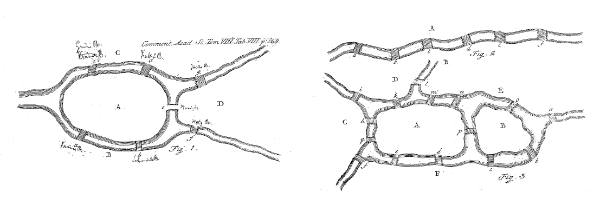
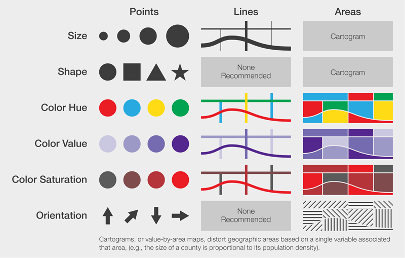
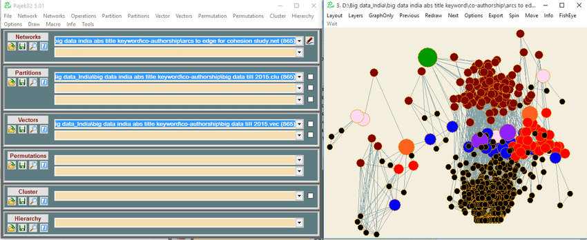
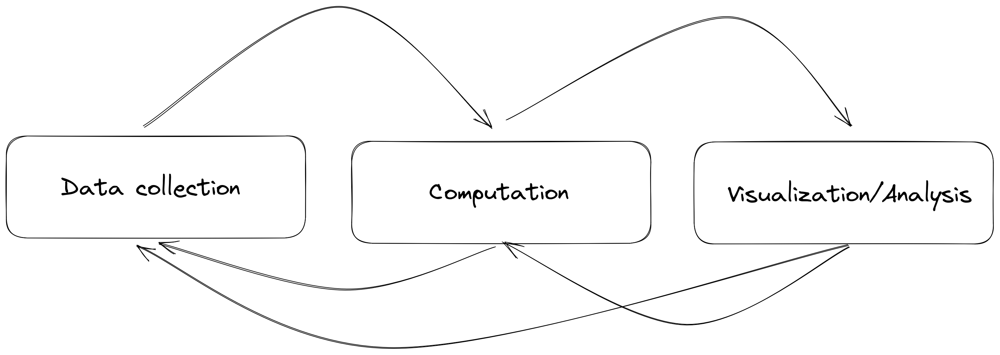

title: Explorer des réseaux dans un carnet interactif avec ipysigma
slug: jupytercon-2023
class: animation-fade responsive
layout: true

<!-- This slide will serve as the base layout for all your slides -->

.bottom-bar[
  {{title}}
]

---

class: impact

## {{title}}

⁂

_Béatrice Mazoyer, Guillaume Plique, médialab SciencesPo_

_Atelier Digit\_Hum 2023_

---

## Où retrouver ces slides ?

* Au format page web :

  [https://medialab.github.io/ipysigma/presentations/digithum-2023]()


* Au format pdf:

  [https://github.com/medialab/ipysigma/blob/master/presentations/pdf/digithum-2023.pdf]()

---

## Qui sommes nous ?

**Guillaume Plique** et **Béatrice Mazoyer**, ingénieur·e·s de recherche au
[médialab](medialab.sciencespo.fr/) de Sciences Po.

Un laboratoire de sciences sociales fondé par Bruno Latour il y a dix ans,
qui fait dialoguer plusieurs disciplines :

* la sociologie
* le design
* l'ingénierie

---

## Qu'est-ce qu'un réseau / un graphe

Un ensemble de **nœuds** et de **liens**, et les métadonnées associées.

<br>

<center>
  
</center>

---

class: impact

## L'analyse visuelle de réseaux

---

## Une approche statistique des graphes

* Diamètre
* Densité
* Distribution des degrés
* Plus court chemin
* Centralité
* Valeurs propres
* Algèbre linéaire (un graphe est une matrice, une matrice est un graphe)
* Pagerank
* etc.

---

## Que nous apporte la visualisation de graphes ?

<br>

<center>
  
</center>

---

## Que nous apporte la visualisation de graphes ?

<br>
<br>

<center>
  
</center>

---

class: impact

## L'analyse visuelle de réseaux en sciences sociales

---

## Les sociogrammes de Moreno

<table>
  <thead>
    <tr>
      <th>id</th>
      <th>Prénom</th>
      <th>Premier vœu</th>
      <th>Second vœu</th>
    </tr>
  </thead>
  <tbody>
    <tr>
      <td>1</td>
      <td>Amélie</td>
      <td>4</td>
      <td>3</td>
    </tr>
    <tr>
      <td>2</td>
      <td>Jean</td>
      <td>1</td>
      <td>3</td>
    </tr>
    <tr>
      <td>3</td>
      <td>Kareem</td>
      <td>2</td>
      <td>26</td>
    </tr>
    <tr>
      <td>4</td>
      <td>Lydia</td>
      <td>45</td>
      <td>12</td>
    </tr>
    <tr>
      <td>5</td>
      <td>Michael</td>
      <td>7</td>
      <td>28</td>
    </tr>
    <tr>
      <td>6</td>
      <td>Guillaume</td>
      <td>18</td>
      <td>3</td>
    </tr>
    <tr>
      <td>...</td>
      <td>...</td>
      <td>...</td>
      <td>...</td>
    </tr>
  </tbody>
</table>

Moreno, J. L. (1934). Who shall survive?: A new approach to the problem of human interrelations.

---

## Les sociogrammes de Moreno

<center>
  
</center>

---

## Les variables visuelles de Bertin

<center>
  
</center>

---

## Détection de communautés, spatialisation, etc.

<center>
  
</center>

---

class: impact

## Logiciels et outils d'analyse visuelle de réseaux

???

Social science researchers were not used to program. Desktop apps were a de facto requirement.

---

## Pajek

<br>

<center>
  
</center>

---

## Gephi

<br>

<center>
  
</center>

---

## Sigma

<br>

<center>
  
</center>

---

## MiniVaN

<br>

<center>
  
</center>

---

## Nansi

<br>

<center>
  
</center>

---

## Retina

<br>

<center>
  
</center>

---

## Gephi Lite

<br>

<center>
  
</center>

---

class: impact

## Une app pour les chercheurs en Sciences Sociales utilisant Python

---

## Un processus itératif

<br>

<center>
  
</center>

---

## Problèmes rencontrés lors du design de Nansi

Deux besoins contradictoires:

1. Un outil à l'usage des étudiants
2. Un outil adapté à notre propre processus de traitement/exploration/analyse de données


---

class: impact

## Pourquoi ne pas faire l'analyse visuelle de réseaux directement dans un Jupyter Notebook ?

---

## ipysigma

```
pip install jupyterlab
pip install networkx # or igraph
pip install ipysigma
```

<center>
  
</center>

---

class: impact

## Demo time! (En espérant que ça fonctionne)

---

## Un trésor de variables visuelles

* **nœuds**
  * color, saturation
  * size
  * label, label size, label color, label font
  * border size, border ratio, border color
  * pictogram, pictogram color, shape
  * halo size, halo color
* **liens**
  * color
  * type
  * size
  * curveness
  * label

---

## Petits multiples

<br>

<center>
  
</center>

---

## Exports

<iframe src="https://medialab.github.io/ipysigma/demo.html" width="100%" height="450px" style="border: none"></iframe>

---

## Développements futurs

* Représentations spécialisées, telles que :
  * Réseaux temporels
  * Réseaux biparti
  * etc.

* Meilleur support pour différentes instances de Jupyter :
  * notebook
  * lab
  * colab
  * vscode
  * etc.

---

## Un logiciel libre

* GitHub : https://github.com/medialab/ipysigma
* Slides: https://medialab.github.io/ipysigma/presentations/digithum-2023
* Demo: https://medialab.github.io/ipysigma/demo.html

*Dépendences*

* graphology: https://graphology.github.io/
* Sigma.js: https://www.sigmajs.org/

---

# Merci pour votre attention !

<center>
  
</center>
