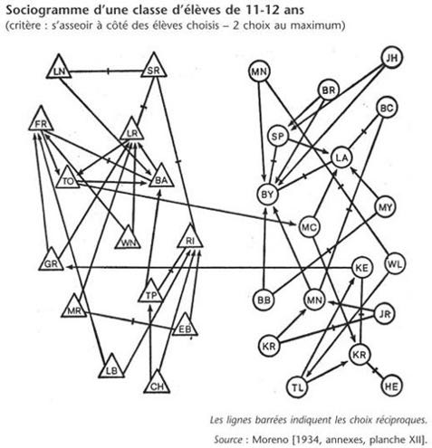
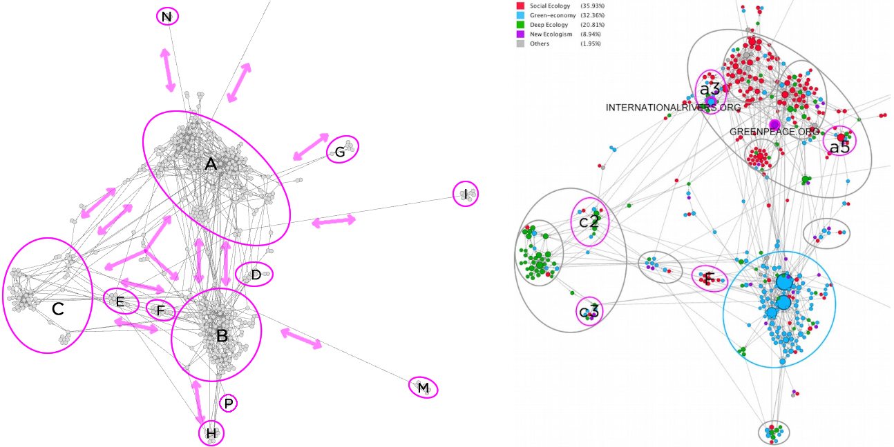
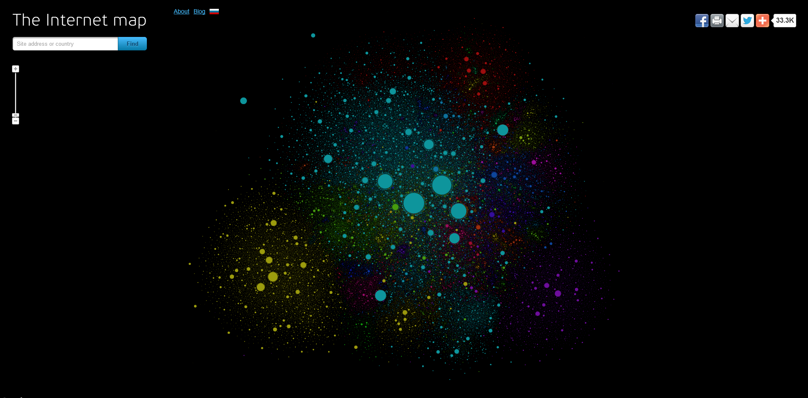
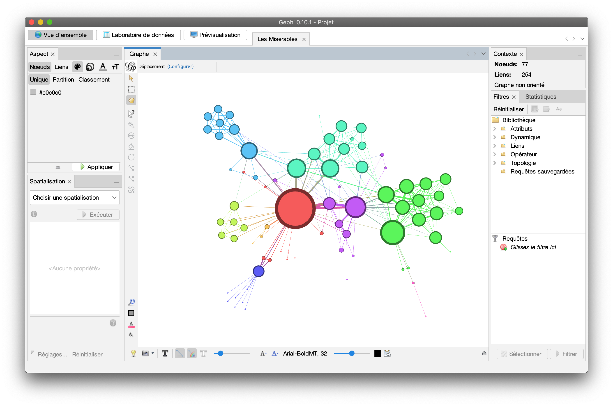
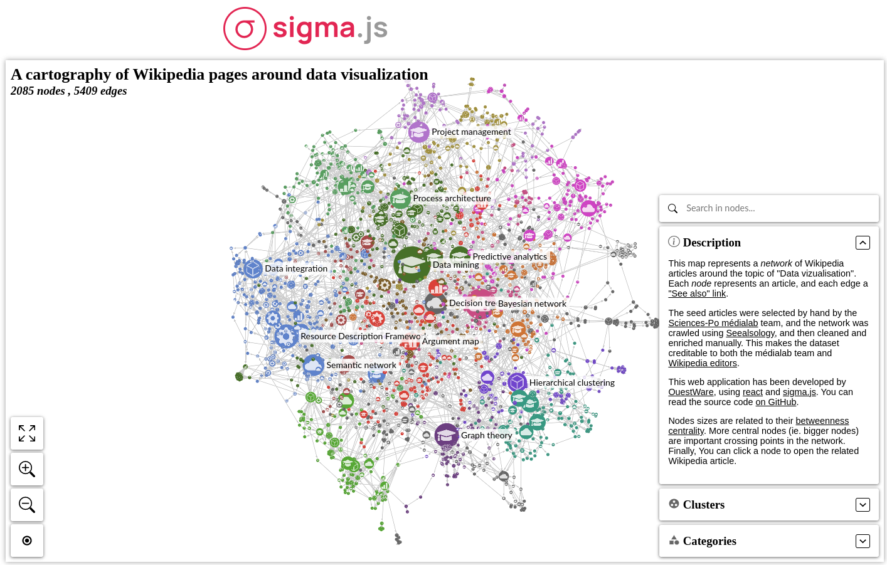
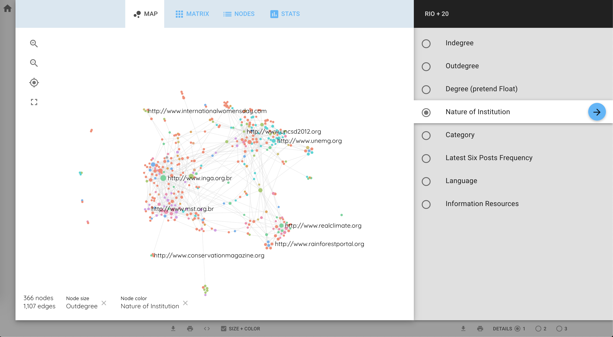
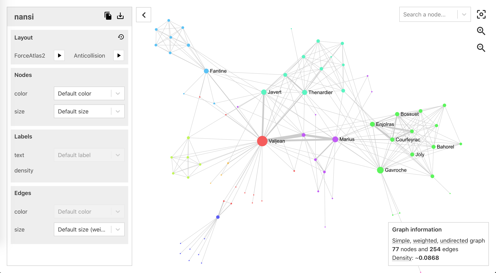
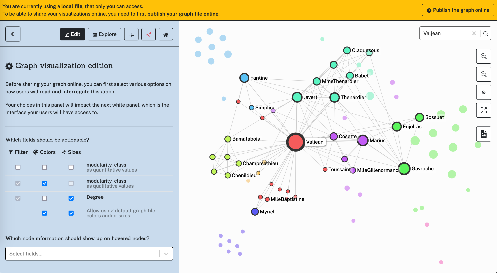
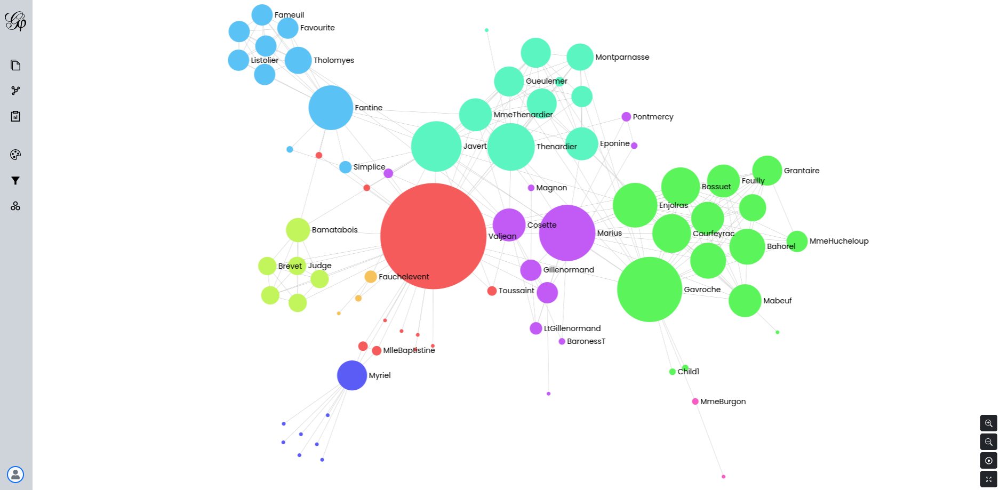

title: ipysigma - a Jupyter widget for interactive visual network analysis
slug: ipysigma
class: animation-fade responsive
layout: true

<!-- This slide will serve as the base layout for all your slides -->

.bottom-bar[
  {{title}}
]

---

class: impact

# ipysigma

## a Jupyter widget for interactive visual network analysis

_Graph devroom, FOSDEM 2023_

---

class: impact

_<s>Guillaume Plique</s> Benjamin Ooghe-Tabanou, médialab SciencesPo_

_Special thanks to ✨Laura Miguel✨ for data collection and processing_

---

class: impact

### Visual Network Analysis: why & how

---

## 1736: Leonhard Euler & the 7 Bridges of Königsberg

  

---

## 1934: Jacob Levy Moreno's sociograms

  

---

## 20th century: computer assisted layout & clustering

  

---

## Graphs are like maps

  

---

## Graphs help us navigate and locate

  

---

class: impact

### A brief history of interactive tools

---

## For the desktop first, for instance [Gephi](https://gephi.org/) 

  

---

## Then for the web, thanks to libs like [Sigma.js](https://www.sigmajs.org/)

  

---

## which enabled developing Gephi-like tools for the web

Like [MiniVaN](https://medialab.github.io/minivan/), ...

  

---

## which enabled developing Gephi-like tools for the web

Like MiniVaN, [Nansi](https://medialab.github.io/nansi/), ...

  

---

## which enabled developing Gephi-like tools for the web

Like MiniVaN, Nansi, [Retina](https://ouestware.gitlab.io/retina/1.0.0-beta.1/), ...

  

---

## which enabled developing Gephi-like tools for the web

Like MiniVaN, Nansi, Retina, and soon [Gephi-lite](https://github.com/gephi/gephi-lite)!

  

---

class: impact

### We now have many rich interactive tools allowing us to visualize, explore, manipulate and publish graphs.

### &nbsp;

### But...

---

class: impact

### ...all of them require pre-computed graphs (saved as GEXF, GraphML, JSON, etc.).

### &nbsp;

### What if we want to juggle between building/coding our graph and quickly visualizing/exploring it interactively?

---

## We can mix Jupyter notebooks and Sigma.js!

  

---

class: impact

### Let's play with it!

<pre><code>
    pip install jupyter
    pip install networkx        # or igraph
    pip install ipysigma

</code></pre>

